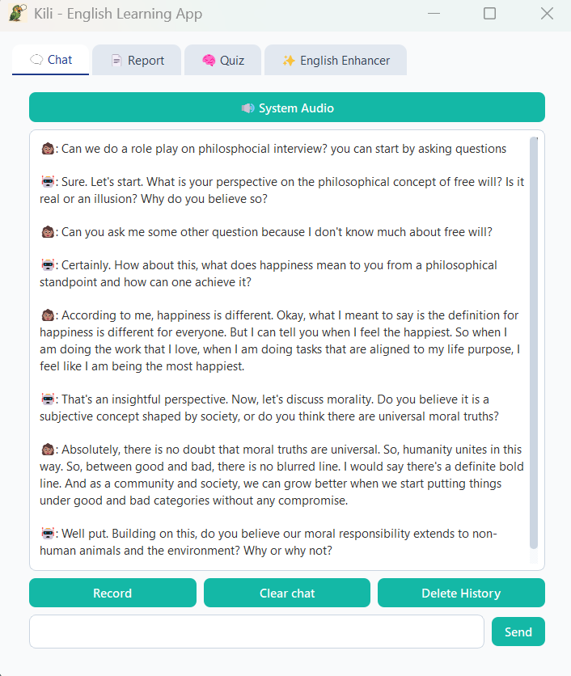
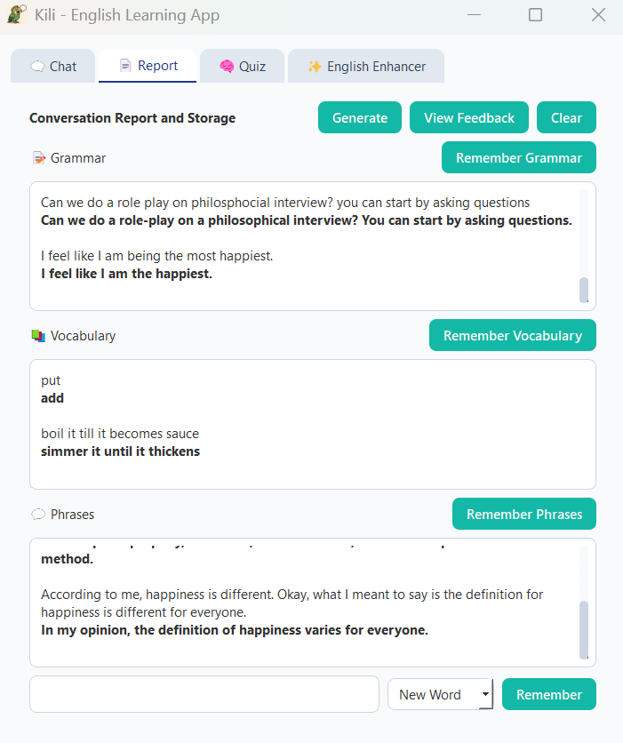
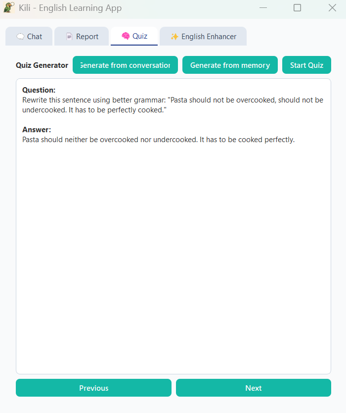
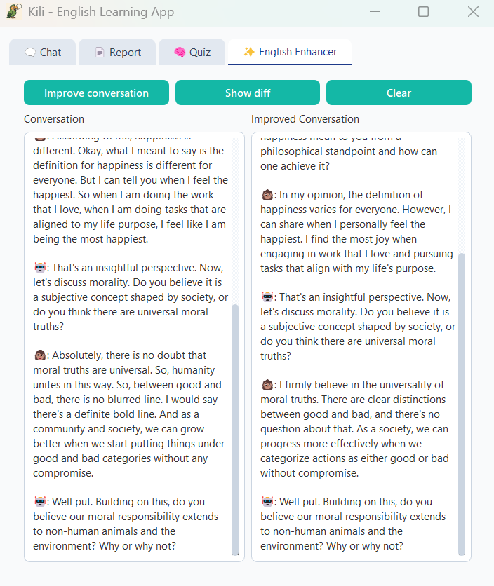

# Kili English Learning App

Learn English Through Conversation, Reflection, and Recall

**Description:**
Kili (கிளி), named after the parrot in Tamil, is an interactive English learning assistant that helps you improve through natural conversation. Speak freely with Kili, build real-time dialogues, and receive intelligent feedback on grammar, vocabulary, and phrasing. Every conversation is recorded and analyzed, with learnings stored in a local database. Revisit what you've learned using random quizzes designed to test your recall and reinforce better language use—all in a simple, conversational interface.

**Prerequisite:** 
Please ensure [FFmpeg](https://ffmpeg.org/download.html) is installed and its binary path is added to your system's environment variables (PATH), so the application can access it from the command line.

**Applications UI:**

